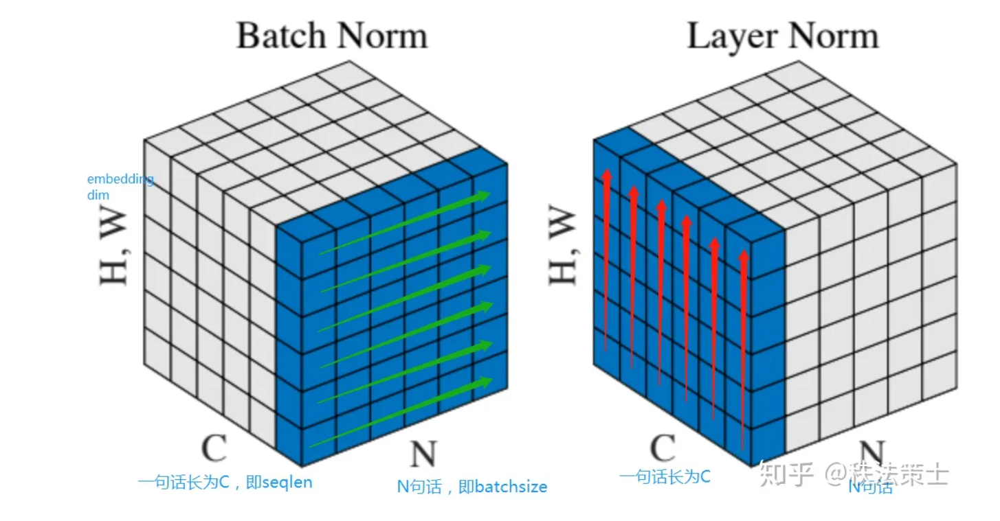

> 今天和一位量化公司的学长聊了会天，被问了一些比较有意思、值得思考的问题。由于本人才疏学浅，很多问题都没有一个比较好的答案，后来把一些问题记录了一下，结合网上搜索的内容得到了一个粗浅的答案，谨在此略作记录

### Math

Q1: 什么是特征分解？几何含义是什么？

特征分解比较简单，每个矩阵都有一些特征值，每个特征值有对应一组特征向量基，其代数重数之和为矩阵的秩。可以写成$A=QΛQ^{-1}$的形式。Q是特征向量矩阵，Λ是对角阵，对角元是对应的特征值。

几何含义我没有答上来，后来搜索了一下。说是一种旋转、放缩的操作。放缩容易理解，对于每个特征向量$x$而言，都有$Ax=\lambda x$，相当于是对特征向量的放缩，旋转是什么意思呢？因为有会的大佬可以讨论一下qaq

[Refer](https://blog.csdn.net/lipengcn/article/details/51992766)

Q2: 假设有许多iid的变量$x_1, x_2……x_n$，已知其服从$N(\nu, \sigma^2)$，其中$\sigma^2$已知，如何以p的置信度得到$\nu$？置信度p是什么意思？

首先考虑置信

### Computer science

Q0：Batch Normalization和Layer Normalization有什么区别？

个人理解(在NLP语境下)：假设输入有三个维度，[batch_size, seq_len, dims]，则Batch Normalization是对不同batch的数据特征进行归一化，Layer Normalization是对一条数据的不同特征进行归一化

如下图所示，假设输入为(32, seq_len, 100)。Batch Normalization每次抽取(32, 100)的矩阵进行归一化，基元是(32,1)的向量(固定句子中token的位置，将不同的词向量维度沿着batch的方向归一化)；Layer Normalization每次抽取(seq_len, 100)的矩阵进行归一化，基元是(1, 100)的向量(固定batch中的一个sample，将其不同位置的token沿着词向量的维度进行归一化)

在应用上，Bacth Normalization不适用于NLP这种不同seq_len差别较明显的场景，但在CV领域数据比较规整的场景有较好的应用；Layer Normalization与seq_len关系不大，在NLP等领域应用前景较好

Q1: Tranformer 架构模型的 position encoding是什么？Transformer如何有效利用这些 position encoding 信息

Q2: Transformer 模型如何防止数据的 Overfit? 

A1: 数据增强：在量化交易中，根据已有的股票数据如何进行数据增强？

A2: Dropout：Dropout防止过拟合的原理是什么？

A3: 正则化：L1和L2 范数有什么区别？在使用的时候这两个范数效果会有哪些差别？

Q3: 设想一下量化交易的场景，股票每天股值的变化是一个连续的数值。但我们也可以将其量化到一个个离散的数值(例如前1/5是A类股，之后是B类股，C类……)。对于这两类问题，前者我们可以用regressive method 来回归拟合，后者相当于是一个分类问题。在实际情况下，这两种方法有哪些优点和缺点，原因是什么？

`未完待续，解答等之后有时间陆续补充` 