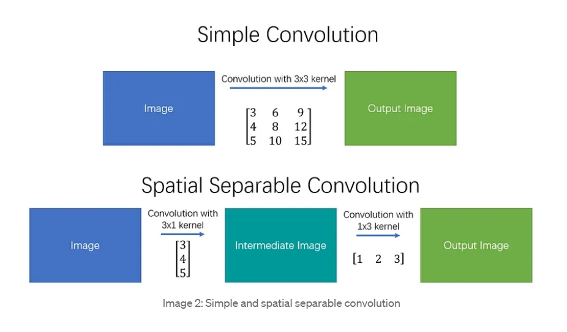

> V1和V2差别不大，图片都有几张重复的，V2只是在V1的基础上加了几个新的Trick，Backbone替换了一下，因此此处直接记录V2

图像分割分类：

- 语义分割(Semantic Segmentation)：对image中的每个pixel都分配一个label
- 实例分割(Instance Segmentation)：对每一个物体实例进行分割
- 全景式分割(Panoptic Segmentation)：语义分割与实例分割的结合，既给每个pixel分配label，又区分不同的物体实例

语义分割与实例分割一个具体的区别：如果场景中有许多人，则语义分割只会区分一个Pixel是否代表人，而实例分割会区分不同的人

### V2前置工作——SPPNet

[博客介绍](https://medium.com/coinmonks/review-sppnet-1st-runner-up-object-detection-2nd-runner-up-image-classification-in-ilsvrc-906da3753679)

SPPNet在物体识别和图像分类上都有很不错的效果

传统意义上卷积层中只有一个/没有池化层，而SPP网络建议有多个不同Scale的池化层。具体而言，通过不同Scale的Pool将图片转成不同维度的Output，最后将这些Output Concatenate在一起得到一维向量，最终将一维向量输入FC投得到最终的分类结果。SPP的好处是不需要输入固定尺寸的图片，输入图片的尺寸变得更加灵活

Multi-size Training：SPPNet的存在使得网络可以接收不同尺寸的照片输入，相应的可以增加网络训练的robustness

Multi-view Testing：可以通过输入不同视角下的图片增加模型的准确性

和R-CNN的最大区别在于：他们都是通过Region Proposal确定不同的bbox可能处在的位置，SPP网络是将整张图片输入，只在最后一个线性层前输入不同的conv block，将多个conv block的输出拼接成一个长Tensor作为最终预测头的输入；R-CNN则是将每个Region Proposal都通过一遍Net来预测是否有bbox，速度很慢。因此SPPNet在显著提升速度的前提下达到了和R-CNN comparable的metric

### [V2简介](https://arxiv.org/pdf/1606.00915.pdf)

[Medium博客介绍](https://towardsdatascience.com/review-deeplabv1-deeplabv2-atrous-convolution-semantic-segmentation-b51c5fbde92d) 

传统的DCNN进行图像分割有几点坏处，Deeplab针对这些坏处设计了对应的解决方法进行缓解

- 分辨率过低：传统的DCNN有很多的最大池化和下采样操作，导致分辨率显著下降。本工作中DCNN的最后几层使用了上采样操作，保证输出有较高的准确率，称为Atrous convolution操作，可以提升感受野的同时不增加参数数量/计算量
- 不同尺寸物体的存在：标准方法是将各种不同大小图片提供给DCNN，并将得到的feature map进行聚合，但缺点是需要DCNN每一层针对不同的图片都提供对应的feature map。通过使用不同scale的Altrous convolution采样达到类似的效果且效率更高，称为ASPP
- pixel-wise的segmentation操作不准确：图像分割需要很准确，而经过多次下采样后图像严重变形会导致pixel-wise的识别不准确，作者指出使用CRF可以提升相应准确率

整体流程：

1. 将ResNet/VGG中的全连接层替换为卷积层，变成全卷积层
2. 使用atrous convolutional layers，从32pixel采样修正为8pixel采样
3. 使用bi-linear interpolation，与上采样系数8，达到和最初图像相同分辨率
4. 将结果丢入全连接CRF，修正分割的结果

优点：速度 + 准确率 + 简易性

前置知识：空度卷积的理解([CSDN](https://blog.csdn.net/qq_39478403/article/details/121172670) + [微信公众号](https://mp.weixin.qq.com/s/aSVtk1P3rVoHzlhQoKYHEQ))，空洞卷积使得计算量、参数不变的前提下感受野显著增加，有利于图像分割

两种Handle Multiple Scale物体的方式：不同分辨率图片输入(费时间) / 一组图片输入，使用类似金字塔的方式进行feature表示(本实验中采用该方法)

提升边界对比度：使用Fully Connect CRF方法，通过惩罚不一样的Pixel增加对比度(惩罚和距离也正相关)，使得物体的边界更容易被定位

此外，将Backbone网络从VGG换成ResNet也大幅提升了Metric(ResNet真的太NB了啧啧啧)

### V3简介

1*1卷积用处：升维降维(改变通道数，进而减少运算量)，同时可以近似认为和MLP层等价，实现跨通道信息交互(Refer：[知乎](https://zhuanlan.zhihu.com/p/40050371))

Atrous Convolution(膨胀卷积)好处：不需要更小的图片 / 更大的卷积核也能获得比较大的感受野，同时参数量/计算速度等不会有明显提升

四种有利于图像分割的处理方式：

- 图像金字塔：通过输入不同scale的Image input，大的scale负责全局信息，小的scale负责小物体的细节，最终将多种feaure map融合在一起得到最终的输出。缺点是GPU资源消耗大，一般用于推理阶段
- Encoder-decoder：Encoder负责down-sampling信息，越深层的越能掌握long-range的信息，Decoder负责Upsampling，逐渐还原分辨率

Methods：

- 使用 Atrous Convolution 可以在不增加计算量的前提下学习到更加稠密的特征信息(最终分辨率下降的倍数较少)
- Multi-grid Method没有看懂
- ASPP的问题：如果膨胀系数过大，很多卷积核只有1个有效元素(剩下的都是Padding的0)，作者的应对方案：使用对模型的最后一层特征图使用global average pooling，并通过1*1卷积核进行升维到期望的维度

大的改进：

- 去掉了DenseCRF，一个Deeplab V1和V2中使用的 Post-processing 手段，使得Deeplab变成了一个端到端的深度学习训练系统

Deeplab V3+ 额外使用了一个Decoder结构，Encoder结构就是原本的Deeplab V3。同时其中使用了一种新的卷积Depthwise Convolution，最早在MobileNet中提出，可以在显著提升效率的同时对准确率仅造成轻微影响

### Deeplab V3+前置工作——Xception & MobileNet & FCN & ParseNet

(Inception模块通过将卷积分离来减少参数量，Xception取义自Extreme Inception，感觉就是将卷积分离到极致之后极大减少参数量得到的结果)

[XCeption简介](https://towardsdatascience.com/review-xception-with-depthwise-separable-convolution-better-than-inception-v3-image-dc967dd42568)：一个修改版本的深度可分离卷积(深度可分离卷积是深度卷积 + Pointwise卷积，XCeption受到Inception模块影响，将两个模块位置倒置。在不损失准确率的前提下减少参数量)，模块后没有非线性激活函数，同时效果要好于Inception-V3模块

可分离卷积简介：

- 空间可分离卷积：主要针对矩阵的宽度与高度两个维度，基本思想是卷积核可以分解成向量乘，进而降低总运算量，例如：
  $$
  \begin{bmatrix}
  3 & 6 & 9 \\
  4 & 8 & 12 \\
  5 & 10 & 15
  \end{bmatrix} = \begin{bmatrix}
  3 \\
  4 \\
  5
  \end{bmatrix} \cdot \begin{bmatrix}
  1 & 2 & 3
  \end{bmatrix}
  $$
  最终效果如图：
  

矩阵乘法次数从9次变成6次，有效减少计算量。该方法的缺点：不是所有的卷积核都可以进行类似的分解

- 深度可分离卷积：主要针对的是通道(depth)方向的。一般卷积是直接使用卷积核对原本的图片进行变换得到最终的结果；深度可分离卷积首先通过多个深度卷积核压缩输入大小，最后通过1*1的PointWise卷积核进行变换，通过显著减少的参数量达到相近的效果

  举例：输入是12*12,3通道(RGB)的图片，直接通过5 * 5的卷积核得到256通道的输出，则计算量为(5 * 5 * 3 * 8 * 8 * 256次)；深度可分离卷积的深度卷积核计算量为5 * 5 * 3 * 8 * 8 次(得到的形状为8 * 8 * 3)，之后的PointWise卷积计算量为1 * 1 * 3 * 8 * 8 * 256，相加后依然显著少于原本的计算量

[MobileNet简介](https://medium.com/@godeep48/an-overview-on-mobilenet-an-efficient-mobile-vision-cnn-f301141db94d)：也是深度可分离卷积的一个运用，谷歌开源的一个可以在移动端(edge-device)上使用的神经网络，还有两个策略可以进一步压缩模型大小，最终在模型较小的前提下达到了非常不错的效果。

[MobileNet V2简介](https://towardsdatascience.com/review-mobilenetv2-light-weight-model-image-classification-8febb490e61c)：在V1的基础上增加了倒置残差结构，同时移除了浅层网络中的非线性层

[FCN进行语义分割简介](https://towardsdatascience.com/review-fcn-semantic-segmentation-eb8c9b50d2d1)：传统进行图像分类时，都是在downsampling 之后加上 FC 层，最终输出的是一个 1*1 的标签代表最终的输出类别。但在FCN层中，作者将FC层替换为1 * 1的卷积，输出形状不是1 * 1，并通过Deconvolution进行上采样，得到和最开始一样分辨率的图像。关键点在于：随着网络层数加深，feature map的局部信息减少，整体信息增多，因此需要fuse不同深度的信息来得到更完整信息。

[ParseNet简介](https://medium.datadriveninvestor.com/review-parsenet-looking-wider-to-see-better-semantic-segmentation-aa6b6a380990)：Deeplab V3的global image information就来源于这篇文章。

### Deeplab V3+简介

- 使用了Atrous Depthwise Convolution，也就是将深度可分离卷积中的第一步深度卷积每个Channel换成了膨胀卷积，可以在维持性能表现的同时，显著降低计算复杂度
- 引入了Encoder-Decoder架构，Encoder是Deeplab V3，通过将网络最后几层的卷积替换成膨胀卷积，有效减少了图形分辨率降低的倍数；Decoder架构将原本直接Upsampling 16 *的过程转换为了：先是Upsampling 一个4 *，之后将当前信息与low level的图片信息fuse在一起，再Upsampling一个4 *，效果变得好了很多
- Backbone网络使用了Modified Aligned Xception，相较于Aligned Xception网络更深，且将max_pooling层替换为了atrous seperable convolution

### Deeplab V3+ 论文阅读

文章考虑了使用spatial pyramid pooling module 与 encoder-decoder架构的神经网络，前者通过不同分辨率的池化层获取语义信息，后者可以获得更好的物体边界信息

- encoder负责获取语义信息，decoder负责获取边界信息
- 可以通过调整膨胀卷积控制抽取的encoder特征的分辨率，进而实现precision 和 runtime 的 trade-off
- 利用DeepLab V3作为encoder，可以抽取语义信息。DeepLab V3中使用的膨胀卷积使得output_stride(抽取出的特征图分辨率与原始图分辨率的比例)可以更小
- decoder上，先Upsampling 4倍，并与低层的图片信息相结合(底层图片信息通过1 * 1卷积修改通道数来改变权重)，之后再Upsampling 4倍，会比直接Upsampling 16倍要更好
- Modified Aligned Xception：在Aligend Xception Model的基础上进行了几点改变：
  - 更深的Xception Network
  - 将所有的最大池化层替换为有步长的深度可分离卷积
  - 在每一个3 * 3的深度卷积之后添加Batch Normalization和ReLU激活函数