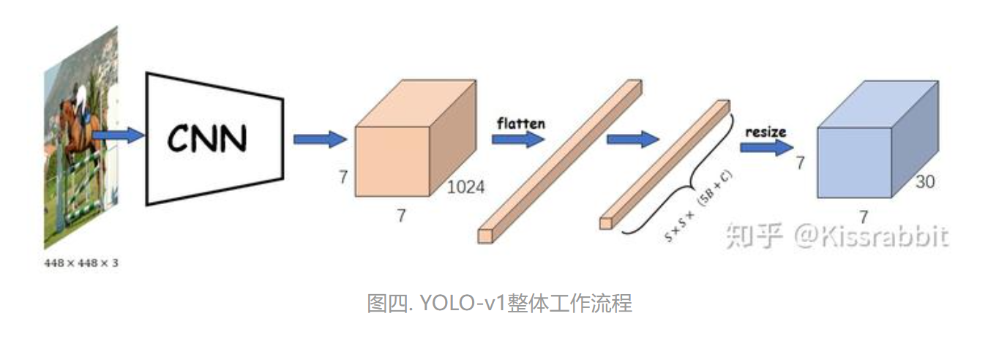
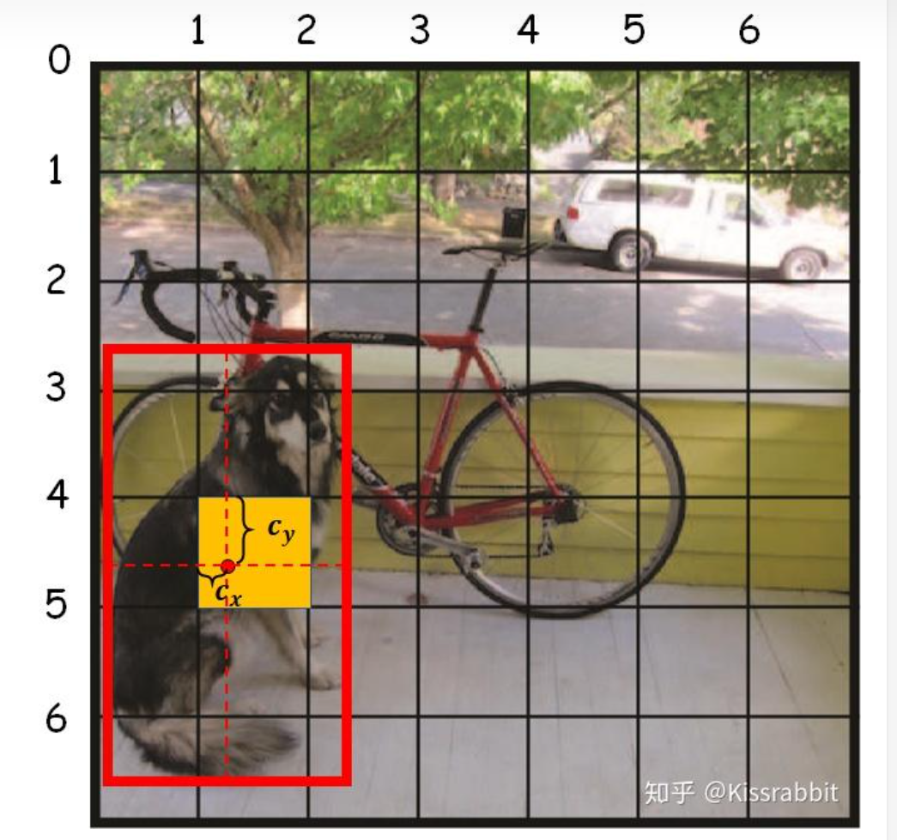
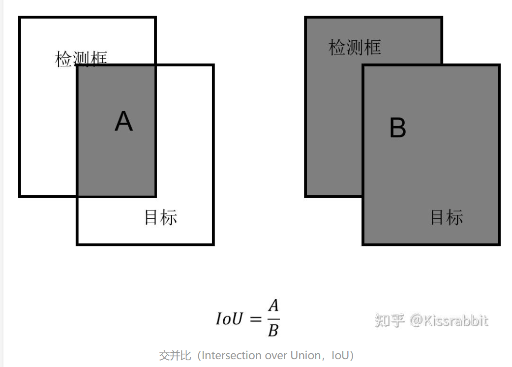
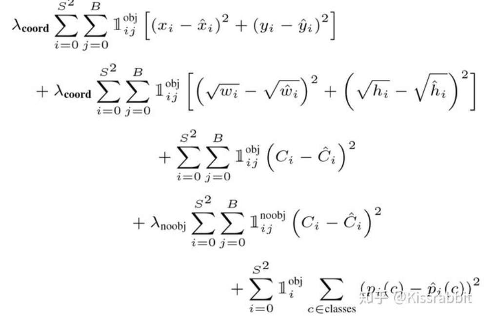
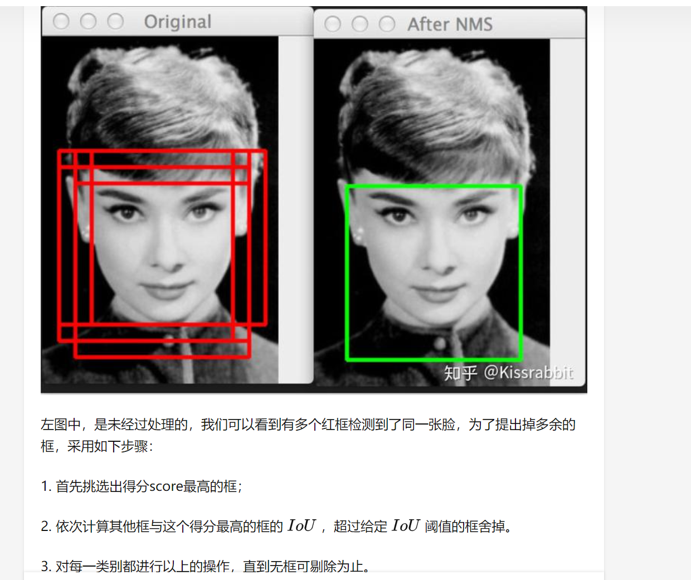

# [初识YOLO ——知乎](https://www.zhihu.com/column/c_1364967262269693952)

### 历史背景

目标检测的传统方法：

1. 从图像中提取人工视觉特征
2. 将提取出的视觉特征输入给SVM进行分类

2014的R-CNN和2015年的YOLO提出了两种新方法：

1. 以R-CNN为代表的two-stage
2. 以YOLO为代表的one-stage

目标检测网络包括：

1. Backbone network: 提取必要的特征信息，常见方法是Imagenet Pretrained(使用在ImageNet上调好的参数训练)。Kaiming的《**Rethinking ImageNet Pre-training**》则指出不用Imagenet Pretraining，训练足够久也可以达到相同的效果。
2. Neck network: Neck是一个中间结构，把不同大小卷积核得到的信息结合起来，最终形成一个具有多重感受野的网络架构，常见的有FPN和SPP
3. Detection head: 通常为卷积层，提取信息后进行输出

### Yolo-V1 入门

最大特点：仅使用一个神经网络端到端的实现检测物体的目的

检测原理：输入是 448 * 448 的图像，输出是 7 * 7 * 30 的特征图。7 * 7 是指原图经64倍降采样(stide 为64的核)，通道数为30—每个位置($grid_x, grid_y$)预测两个bounding box，每个 bounding box 由置信度$C$ 与矩形框参数 ($c_x, c_y, w, h$)构成，共10个参数。此外加上20个类别共30个通道。置信度表征其中是否有目标物体。一般情况的通道数：$5B+C$，其中$B$是每个位置预测的bbox数量，$C$是类别数量。

Yolo相当于是对448 * 448的图片进行了7 * 7的等分，最后预测的参数总量是$S*S*(5B+C)$，这里$S$就是$\frac{448}{7}=64$

Yolo-V1整体流程如图：

Yolo-V1的输出包含三个部分：

- objectness: 置信度，表示网格中是否有物体
- class: 类别预测
- bbox: 边界框

Yolo-V1的正样本制作方法：

Yolo-V1的目标是预测物体的中心点，因此物体中心点所在网格的objectness概率是1。有可能存在物体的网格被称为“正样本候选区域”，标签的正样本只会来源于此。

bbox的置信度计算公式：
$$
P_r(Class_i|Object)*P_r(Object)*IOU_{pred}^{truth}=P_r(Class_i)*IOU_{pred}^{truth}
$$
训练时，正负样本对应的$P_r(objectness)$分别是1和0，$IOU_{pred}^{truth}$是预测的bbox和训练label之间的IoU。$P_r(Object)*IOU_{pred}^{truth}$一方面是看其中是否有物体，另一方面看该bbox的预测质量，如果置信度低于0.5认为是背景，会被过滤掉(不认为是正样本)，剩下的被认为是前景。最终的score计算公式为$score=P_r(object)*P_r(Class_i)$

计算中心点所处网格：假设物体的bounding box参数为($x_{min}, y_{min}, x_{max}, y_{max}$)，则中心点为$(center_x, center_y)=(\frac{x_{min}+x_{max}}{2}, \frac{y_{min}+y_{max}}{2})$，而网格位置为$(grid_x, grid_y)=(\lfloor\frac{center_x}{stride}\rfloor, \lfloor\frac{center_y}{stride}\rfloor)$，量化误差为$(c_x, c_y)=(\frac{center_x}{stride}-\lfloor\frac{center_x}{stride}\rfloor, \frac{center_y}{stride}-\lfloor\frac{center_y}{stride}\rfloor)$，量化误差求网格内的中心点也显然

确定了bbox中心点后，还需要确定宽和高$w,h$。由于$w,h>>1$，而$c_x \in (0,1)$，因此采用归一化$w=\frac{w}{w_{image}}, h=\frac{h}{h_{image}}$

训练过程(针对某个正样本候选区域$(grid_x, grid_y)$)：

1. YOLO v1输出B个预测框
2. 计算B个预测框与此处真实bbox交并比，得到B个loU值
3. 选择loU值最大的作为正样本，计算置信度损失、类别损失和边界框回归损失，置信度损失标签伪loU值
4. 剩下的B-1个框为负样本

IOU：

损失函数：

只有正样本关注bbox和class的损失，正负样本都关注置信度的损失。正样本的$\vec{C_i}$是预测框与真实框的IoU值，负样本的$\vec{C_i}$就是0。

在推理时，边界框得分$score=C_{box}*P_r(class)$，$C_{box}$是置信度，负样本置信度接近0，因此得分接近0；正样本置信度接近1，对应的类别处最终得分接近1。因此Yolo V1的本质是先进行正负样本的二分类，接下来对正样本再做多标签的多分类问题。

最后再做非极大值抑制(NMS)得到最终结果，如图：

### V2简介

注：V1是入门，因此笔记较为详细，从V2开始笔记逐渐简单化

V2主要在V1的基础之上引入了anchor box机制(使用kmeans聚类方法给一些先验的bounding box分布，不需要模型从头开始学习)，以及引入了一些Batch Normalization的正则化机制，同时增加了多尺度训练的trick，进而达到了更高的指标

V2与V1的主要不同：

- 在anchor-box机制下，V2会在每个网格处设置多个先验框，每个先验框都输出{置信度，偏移量，类别}的组合，因此最终输出的通道数与原先不同
- 正样本制作方法：由于每个网格会有多个anchor-box，因此计算IoU和真实网格最大的anchor-box作为正样本

### V3简介

V1和V2的缺陷都在于降采样，使得小目标的检测能力较差。其中V2使用了pass through技术，使得降采样16倍的特征图融入了降采样32倍的特征图，不过最终测试依然在降采样32倍的特征图上进行

V3的创新点：使用了FPN与多级检测

FPN：小目标重视细节信息，主要由浅层网络负责检测；大目标需要感受野较大，由深层网络检测

分而治之—多级检测，不同尺度的物体由不同尺度特征图检测，代表是FPN

合而治之—所有物体都在一个特征图上检测，代表是YOLO

YOLO V3使用FPN多级检测，在三个降采样尺度的特征图上进行目标检测，每个网格放置三个先验框，每个先验框预测(1—置信度+C—类别数+4—bbox尺寸)

最后通过IoU计算每个框分别由大/中/小尺度的先验框进行预测(直觉是真实框和尺寸匹配的先验框计算出的IoU值会更大)，也可以使用动态匹配 + anchor box free的方法进行样本匹配

V3相较于V2最大的好处是引入多级检测之后，检测小目标变得更加方便

### V4简介

V4是一名俄国学者在原作者V3的基础上提出来的，其中加入了许多相关的trick

#### 输入端trick

- Mosaic数据增强：可以丰富数据集，让小目标在更多图片中出现；同时一张图片可以出现多张图片数据，有效减少GPU mini-batach的大小

#### Backbone trick

- CSPNet
- Mish激活函数
- Dropblock：类似于DropBlock，但卷积层在丢弃某个神经元信息后仍然可以从相邻激活单元学习相同信息，因此干脆对整个局部区域进行删减丢弃

#### Prediction trick

- CIOU_Loss：在IOU_Loss的基础上考虑了多种可能的问题，使得预测框回归的速度和精度更快